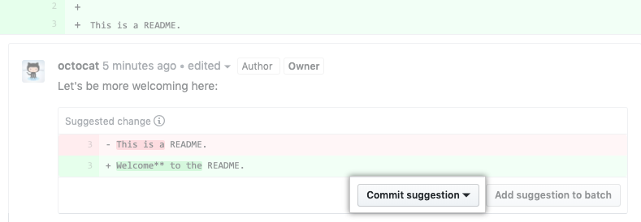

# Contributing

[![Matrix chat][matrix-image]][matrix-url]
[![Merged PRs][prs-merged-image]][prs-merged-url]
[![GitHub contributors][contributors-image]][contributors-url]
[![CLA assistant][cla-assistant-image]][cla-assistant-url]
[![license][license-image]][license-url]

[matrix-url]: https://matrix.to/#/#tldr-pages:matrix.org
[matrix-image]: https://img.shields.io/matrix/tldr-pages:matrix.org?label=Chat+on+Matrix
[prs-merged-url]: https://github.com/tldr-pages/tldr/pulls?q=is:pr+is:merged
[prs-merged-image]: https://img.shields.io/github/issues-pr-closed-raw/tldr-pages/tldr.svg?label=Merged+PRs&color=green
[contributors-url]: https://github.com/tldr-pages/tldr/graphs/contributors
[contributors-image]: https://img.shields.io/github/contributors/tldr-pages/tldr.svg?label=Contributors
[cla-assistant-url]: https://cla-assistant.io/tldr-pages/tldr
[cla-assistant-image]: https://cla-assistant.io/readme/badge/tldr-pages/tldr
[license-url]: https://github.com/tldr-pages/tldr/blob/main/LICENSE.md
[license-image]: https://img.shields.io/badge/license-CC_BY_4.0-blue.svg?label=License

Contributions to the tldr-pages project are [most welcome](GOVERNANCE.md)!

All `tldr` pages are stored in Markdown right here on GitHub. Just open an issue or send a pull request, and we'll incorporate it as soon as possible.

To get started, please [sign](https://cla-assistant.io/tldr-pages/tldr) the
[Contributor License Agreement](https://gist.github.com/waldyrious/e50feec13683e565769fbd58ce503d4e).

> [!NOTE]
> When submitting a new command, please base your PR against the `main` branch and check if there's already a pull request in progress for it.

## Guidelines

The basic format of a `tldr` page is a set of concrete usage examples.

Here are a few guidelines to get started:

1. Try to keep pages at around 5 examples. Pages can be longer or shorter when appropriate, but don't exceed the maximum of eight examples.
   Remember, it's OK if the page doesn't cover everything; that's what `man` is for.
2. When in doubt, keep new command-line users in mind. Err on the side of clarity rather than terseness.
   For example, commands that require `sudo` should include it directly in the examples.
3. Try to incorporate the spelled-out version of single-letter options in the example's description.
   The goal is to allow people to *understand* the syntax of the commands, not just *memorize* it.
4. Introduce options gradually, starting with the simplest command invocations and using more complex examples progressively.
5. Focus on details specific to the command and avoid explaining general UNIX concepts that could apply to any command
   (i.e. relative/absolute paths, glob patterns/wildcards, special character escaping, ...).

These are all guidelines, not strict rules.
Use proper judgement, keeping simplicity and user-friendliness as the top priorities.

When in doubt, have a look at a few existing pages :).

## Markdown format

As a quick reference, the format of each page should match the following template:

```md
# command-name

> Short, snappy description.
> Preferably one line; two are acceptable if necessary.
> More information: <https://url-to-upstream.tld>.

- Example description:

`command --option`

- Example description:

`command --option1 --option2 {{arg_value}}`
```

For page descriptions, you can additionally use ``See also: `command`.`` and [subcommand reference](#subcommands).

> [!NOTE]
> While we suggest only two lines for the page description, it is acceptable to have more than two lines if it necessary to add additional information (i.e. [`pacman`](https://github.com/tldr-pages/tldr/blob/main/pages/linux/pacman.md)).

To see some examples of preexisting pages, you can look at:

- [pwd](https://github.com/tldr-pages/tldr/blob/main/pages/common/pwd.md) - one of the simplest command examples
- [tar](https://github.com/tldr-pages/tldr/blob/main/pages/common/tar.md) - page with placeholders

In our pages, we use placeholders defined as being tokens within curly brackets. For example, in `sleep {{5}}`, the user can change 5 to any number.

Other examples but not limited to of our placeholder syntax are:

- `{{path/to/directory}}`
- `{{path/to/directory1 path/to/directory2 ...}}`

For more detailed formatting guidelines,
refer to the [style guide](contributing-guides/style-guide.md).

## Subcommands

Many programs use subcommands for separating functionality, which may require their own separate pages.

For instance, `git commit` has its own page, as well as `git push` and many others.

To create a page for a subcommand, the program and subcommand need to be separated with a dash (`-`), so `git-commit.md` is shown when calling `tldr git commit`.

You should always add a base page (e.g. `git`) that describes the program and basic switches like `--version` or `--help`.

To let others know about the subcommand, add a note saying ``Some subcommands such as `example command` have their own usage documentation`` to the base page.

See these examples for reference:

- [git](pages/common/git.md)
- [git-commit](pages/common/git-commit.md)
- [aws](pages/common/aws.md)
- [aws-s3](pages/common/aws-s3.md)

## Translations

Translation of pages can be done by simply creating the corresponding page within the appropriate language-specific directory, creating that as well if it does not already exist.

> [!IMPORTANT]
> Translations of pages should be done based on the English (US) page in the `pages` directory. If the English pages doesn't exist for the command, it should be added first in a PR before creating a translation.

Language specific directories must follow the pattern `pages.<locale>`, where `<locale>` is a [POSIX Locale Name](https://www.gnu.org/software/gettext/manual/html_node/Locale-Names.html#Locale-Names) in the form of `<language>[_<country>]`, where:

- `<language>` is the shortest [ISO 639](https://en.wikipedia.org/wiki/ISO_639) language code for the chosen language (see [here](https://en.wikipedia.org/wiki/List_of_ISO_639-2_codes) for a complete list).
- `<country>` is the two-letter [ISO 3166-1](https://en.wikipedia.org/wiki/ISO_3166-1) country code for the chosen region (see [here](https://en.wikipedia.org/wiki/ISO_3166-1_alpha-2#Officially_assigned_code_elements) for a complete list).

The `<country>` code is optional and should only be added when it is needed. In other words, only when there is a valid reason to distinguish between a language (`ll`) and its regional dialects (`ll_CC1`, `ll_CC2`, etc.). For example, both `fr_FR` and `fr_BE` should fall under the same `pages.fr` directory since there virtually is no difference in writing between standard French and Belgian French.

> [!IMPORTANT]  
> When adding a new language to `tldr`, it is suggested to add it to the [translation templates](contributing-guides/translation-templates) along with any page additions.

To see the current progress of all translations, you can visit <https://lukwebsforge.github.io/tldri18n/>, which provides a dynamically updated table of all pages and their translations.

Some examples of valid locale tags:

- French: `fr`.
- Chinese: `zh`.
- Chinese (Singapore): `zh_SG`.
- Portuguese (Brazil): `pt_BR`.

A list of translated templates for alias pages can be found [here](contributing-guides/translation-templates/alias-pages.md).

It is acceptable for several pages to get translated in one pull request.

For more information about language specific rules, refer to the [style guide](contributing-guides/style-guide.md#language-specific-rules).

## Inclusive language

Where possible, use inclusive language in the content of pages. For example, prefer terms like "denylist"/"allowlist" instead of "blacklist"/"whitelist", "primary"/"secondary" instead of "master"/"slave", "they" instead of "him"/"her", etc.
Of course, this shouldn't sacrifice content clarity, such as when documenting tools where this terminology has specific technical meanings and its usage is central to explaining the involved concepts.

## Submitting a pull request

### Testing pages locally

Once you have written a `tldr` page, you can test its syntax locally using [`tldr-lint`](https://github.com/tldr-pages/tldr-lint).

The latest version of [NodeJS](https://nodejs.org) is required to install `tldr-lint` with the following command:

```sh
npm install --global tldr-lint
```

Once its installed, you can test your page by running the following command:

```sh
tldr-lint {{path/to/page.md}}
```

Now, you are ready to submit a pull request!

> [!TIP]
> Additionally, inside the `tldr` directory you can install the dependencies using `npm install` command and now when you commit your changes, the tests will run automatically via the pre-commit hook.

### Submitting changes

The easiest way to submit a change is to edit the page directly on the GitHub interface.

Check out the step-by-step instructions (with screenshots) on
[GitHub Help](https://help.github.com/articles/editing-files-in-another-user-s-repository/).

Alternatively, you can do most of the process
[using Git on the command-line](contributing-guides/git-terminal.md).

> [!TIP]
> After creating a pull request, it is suggested to enable the "Allow edits by maintainers" option (This only needs to be done once the first time you create a PR). It allows maintainers to make changes to your pull request and assist you in getting it merged.

### Accepting suggestions within a pull request

The easiest way to apply suggested changes is to accept the suggestion made on your pull request. Refer to the [GitHub docs](https://docs.github.com/pull-requests/collaborating-with-pull-requests/reviewing-changes-in-pull-requests/incorporating-feedback-in-your-pull-request) for more details.

To commit a suggestion to your pull request, click on `Commit suggestion`:



If you want to commit multiple suggestions, go to the "Files changed" tab and batch all suggestions. Now, click `Commit suggestions` button and enter a commit message to create a single commit.

### Commit message

For the commit message of page changes, use the following format:

`{{command}}: type of change`

Where `{{command}}` is the name of the command being modified, and `type of change` can be (but not limited to) one of the following examples:

- For a new page addition: `ls: add page`, `docker-container-rm: add alias page`
- For a page edit: `cat: fix typo`, `git-push: add --force example`
- For a new translation of an existing page: `cp: add Tamil translation`
- For a modification to the translation of an existing page: `cp: fix typo in Tamil translation`
- For related changes to several pages: `grep, find, locate: synchronize format of wildcards`
- For multiple subcommand page additions: `git-{add, push, ...}: add page`
- For modifying multiple pages in a language: `pages.<locale>/*: update pages`

---

For other cases, its suggested to follow <https://www.conventionalcommits.org/> as much as possible.

## Licensing

This repository is licensed under the [Creative Commons Attribution 4.0 International License](LICENSE.md).

The contents of the `scripts/` directory are licensed under the [MIT license](LICENSE.md).

Any contributions to this project are governed by the
[Contributor License Agreement](https://cla-assistant.io/tldr-pages/tldr).
