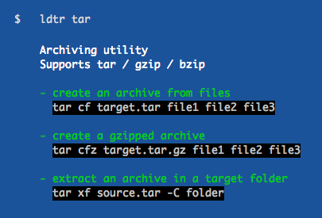

# tldr

[![Build status][travis-image]][travis-url]
[![Gitter chat][gitter-image]][gitter-url]
[![Merged PRs][prs-merged-image]][prs-merged-url]
[![Issue stats][issuestats-image]][issuestats-url]
[![GitHub contributors][contributors-image]][contributors-url]
[![Number of files][tokei-image]][tokei-url]
[![license][license-image]][license-url]

[travis-url]: https://travis-ci.org/tldr-pages/tldr/builds
[travis-image]: https://travis-ci.org/tldr-pages/tldr.svg?branch=master
[gitter-url]: https://gitter.im/tldr-pages/tldr
[gitter-image]: https://badges.gitter.im/tldr-pages/tldr.svg
[prs-merged-url]: https://github.com/tldr-pages/tldr/pulls?q=is:pr+is:merged
[prs-merged-image]: https://img.shields.io/github/issues-pr-closed-raw/tldr-pages/tldr.svg?label=merged+PRs
[issuestats-url]: http://isitmaintained.com/project/tldr-pages/tldr
[issuestats-image]: http://isitmaintained.com/badge/resolution/tldr-pages/tldr.svg
[contributors-url]: https://github.com/tldr-pages/tldr/graphs/contributors
[contributors-image]: https://img.shields.io/github/contributors/tldr-pages/tldr.svg
[tokei-url]: https://github.com/tldr-pages/tldr/tree/master/pages
[tokei-image]: https://tokei.rs/b1/github/tldr-pages/tldr?category=files
[license-url]: https://github.com/tldr-pages/tldr/blob/master/LICENSE.md
[license-image]: https://img.shields.io/github/license/tldr-pages/tldr.svg

A collection of simplified and community-driven man pages.

Install it with `sudo npm install -g tldr`
or [try the web client](http://tldr.ostera.io).

## What is tldr?

New to the command-line world? Or just a little rusty?
Or perhaps you can't always remember the arguments to `lsof`, or `tar`?

Maybe it doesn't help that the first option explained in `man tar` is:

```
-b blocksize
   Specify the block size, in 512-byte records, for tape drive I/O.
   As a rule, this argument is only needed when reading from or writing to tape drives,
   and usually not even then as the default block size of 20 records (10240 bytes) is very common.
```

Surely people could benefit from simplified man pages focused on practical examples. How about:



This repository is just that: an ever-growing collection of examples
for the most common UNIX / Linux / macOS / SunOS commands.

## Clients

You can access these pages on your computer using one of the following clients:

- [Alfred Workflow](https://github.com/cs1707/tldr-alfred)
- Android clients:
  - [tldr-viewer](https://github.com/gianasista/tldr-viewer), available on
    [Google Play](https://play.google.com/store/apps/details?id=de.gianasista.tldr_viewer)
  - [tldroid](https://github.com/hidroh/tldroid), available on
    [Google Play](https://play.google.com/store/apps/details?id=io.github.hidroh.tldroid)
- Bash clients:
  - [tldr](https://github.com/raylee/tldr)
  - [tldr-bash-client](https://github.com/pepa65/tldr-bash-client)
- [C++ client](https://github.com/tldr-pages/tldr-cpp-client): `brew install tldr`
- [Crystal client](https://github.com/porras/tlcr): `brew install porras/tap/tlcr`
- [Dart client](https://github.com/hterkelsen/tldr): `pub global activate tldr`
- [Elixir client](https://github.com/edgurgel/tldr_elixir_client) (binaries not yet available)
- [Emacs client](https://github.com/kuanyui/tldr.el), available on [MELPA](https://github.com/melpa/melpa)
- [Go client](https://github.com/pranavraja/tldr): `go get github.com/pranavraja/tldr` (or [platform binaries](https://github.com/pranavraja/tldr/releases))
- iOS clients:
  - [tldr-man-page](https://github.com/freesuraj/TLDR), available on [App Store](https://appsto.re/sg/IQ0-_.i)
  - [tldr-pages](https://github.com/mflint/ios-tldr-viewer), available on [App Store](https://itunes.apple.com/us/app/tldt-pages/id1071725095?ls=1&mt=8)
- [Haskell client](https://github.com/psibi/tldr-hs) : `stack install tldr`
- [Node.js client](https://github.com/tldr-pages/tldr-node-client) : `npm install -g tldr`
- [Perl5 client](https://github.com/shoichikaji/perl-tldr): `cpanm App::tldr`
- [PHP client](https://github.com/BrainMaestro/tldr-php): `composer global require brainmaestro/tldr`
- Python clients:
  - [tldr-python-client](https://github.com/tldr-pages/tldr-python-client) : `pip install tldr`
  - [tldr.py](https://github.com/lord63/tldr.py): `pip install tldr.py`
- [R client](https://github.com/kirillseva/tldrrr): `devtools::install_github('kirillseva/tldrrr')`
- [Ruby client](https://github.com/YellowApple/tldrb): `gem install tldrb`
- Rust clients:
    - [rust-tldr](https://github.com/rilut/rust-tldr) (online lookup): `cargo install tldr`
    - [tealdeer](https://github.com/dbrgn/tealdeer) (fully featured client with offline cache): `cargo install tealdeer`
- Web clients:
    - [tldr.jsx](https://github.com/ostera/tldr.jsx): http://tldr.ostera.io/
    - [DistroWatch](https://distrowatch.com/dwres.php?resource=man-pages)

There is also a comprehensive [list of clients in our Wiki](https://github.com/tldr-pages/tldr/wiki/TLDR-clients).

## Contributing

- Your favourite command isn't covered?
- You can think of more examples for an existing command?

Contributions are most welcome!
Have a look at the [contributing guidelines](https://github.com/tldr-pages/tldr/blob/master/CONTRIBUTING.md)
and go ahead!

## Similar projects

- [Cheat](https://github.com/chrisallenlane/cheat) allows you to create and view interactive cheatsheets on the command-line.
  It was designed to help remind *nix system administrators of options for commands that they use frequently, but not frequently enough to remember.

- [Bro pages](http://bropages.org/) are a highly readable supplement to man pages.
  Bro pages show concise, common-case examples for Unix commands.
  The examples are submitted by the user base, and can be voted up or down; the best entries are what people see first when they look up a command.

## What does "tldr" mean?

TL;DR stands for "Too Long; Didn't Read".
It originates in Internet slang, where it is used to indicate parts of the text skipped as too lengthy.
Read more in the [TLDR article on Wikipedia](https://en.wikipedia.org/wiki/TL;DR).
