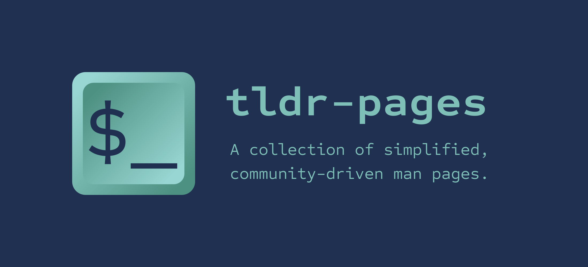

<!-- markdownlint-disable MD041 -->

<div align="center">
  <h1><a href="https://tldr.sh/"></a></h1>

[![Build status][github-actions-image]][github-actions-url]
[![Matrix chat][matrix-image]][matrix-url]
[![Merged PRs][prs-merged-image]][prs-merged-url]
[![GitHub contributors][contributors-image]][contributors-url]
[![license][license-image]][license-url]
[![Mastodon][mastodon-image]][mastodon-url]

[github-actions-url]: https://github.com/tldr-pages/tldr/actions
[github-actions-image]: https://img.shields.io/github/actions/workflow/status/tldr-pages/tldr/ci.yml?branch=main&label=Build
[matrix-url]: https://matrix.to/#/#tldr-pages:matrix.org
[matrix-image]: https://img.shields.io/matrix/tldr-pages:matrix.org?label=Chat+on+Matrix
[prs-merged-url]: https://github.com/tldr-pages/tldr/pulls?q=is:pr+is:merged
[prs-merged-image]: https://img.shields.io/github/issues-pr-closed-raw/tldr-pages/tldr.svg?label=Merged+PRs&color=green
[contributors-url]: https://github.com/tldr-pages/tldr/graphs/contributors
[contributors-image]: https://img.shields.io/github/contributors-anon/tldr-pages/tldr.svg?label=Contributors
[license-url]: https://github.com/tldr-pages/tldr/blob/main/LICENSE.md
[license-image]: https://img.shields.io/badge/license-CC_BY_4.0-blue.svg?label=License
[mastodon-url]: https://fosstodon.org/@tldr_pages
[mastodon-image]: https://img.shields.io/badge/Mastodon-6364FF?logo=mastodon&logoColor=fff
</div>

## What is tldr-pages?

The **tldr-pages** project is a collection of community-maintained help pages
for command-line tools, that aims to be a simpler, more approachable complement
to traditional [man pages](https://en.wikipedia.org/wiki/Man_page).

Maybe you're new to the command-line world. Perhaps you're just a little rusty or can't always recall the arguments for commands like `lsof`, or `tar`?

It certainly doesn't help that, in the past, the first option explained in `man tar` was:

```console
$ man tar
...
-b blocksize
   Specify the block size, in 512-byte records, for tape drive I/O.
   As a rule, this argument is only needed when reading from or writing to tape drives,
   and usually not even then as the default block size of 20 records (10240 bytes) is very common.
...
```

There is room for simpler help pages focused on practical examples.
How about:

<picture>
    <source media="(prefers-color-scheme: dark)" srcset="https://github.com/tldr-pages/tldr/blob/main/images/tldr-dark.png">
    <source media="(prefers-color-scheme: light)" srcset="https://github.com/tldr-pages/tldr/blob/main/images/tldr-light.png">
    
</picture>

This repository is just that: an ever-growing collection of examples
for the most common UNIX, Linux, macOS, FreeBSD, NetBSD, OpenBSD,
SunOS, Android, Windows, Cisco IOS, and DOS command-line tools.

## How do I use it?

> [!TIP]
> For browsing without installing a client on your computer,
> see the web client at <https://tldr.inbrowser.app> (with offline support using PWA).

There are several official clients available.

### Python client

The official [Python client](https://github.com/tldr-pages/tldr-python-client) can be installed from [PyPI](https://pypi.org/project/tldr/) via [pipx](https://github.com/pypa/pipx) (or [other package managers](https://github.com/tldr-pages/tldr-python-client#installation)):

```shell
pipx install tldr
```

### Rust client

Linux and Mac users can also install the official [Rust Client](https://github.com/tldr-pages/tlrc) using [Homebrew](https://formulae.brew.sh/formula/tlrc), [Cargo](https://crates.io/crates/tlrc)
(or [other package managers](https://github.com/tldr-pages/tlrc#installation) on other operating systems):

```shell
brew install tlrc
```

```shell
cargo install tlrc --locked
```

Windows users can also install the official [Rust Client](https://github.com/tldr-pages/tlrc) using [Winget](https://github.com/microsoft/winget-pkgs/tree/master/manifests/t/tldr-pages/tlrc) (or [other package managers](https://github.com/tldr-pages/tlrc#installation) on other operating systems):

```shell
winget install tldr-pages.tlrc
```

### Node.js client

Alternatively, you can also use the official [Node.js client](https://github.com/tldr-pages/tldr-node-client), although it has fallen behind in updates:

```shell
npm install -g tldr
```

Then you have direct access to simplified, easy-to-read help for commands, such as `tar`,
accessible through typing `tldr tar` instead of the standard `man tar`.

If you don't want to install any software, check out the [PDF version](https://github.com/tldr-pages/tldr/releases/latest/download/tldr-book.pdf) instead.

> [!NOTE]
> PDFs for translations are available for most languages. You can find them in the release assets of the [latest release](https://github.com/tldr-pages/tldr/releases/latest).

There are also **various other clients** provided by the community,
both for the command-line and for other platforms.
For a comprehensive list of clients, head over to our [Wiki](https://github.com/tldr-pages/tldr/wiki/Clients).

## How do I contribute to tldr-pages?

All contributions are welcome!

Some ways to contribute include:

- Adding your favorite command that isn't covered.
- Adding examples or improving the content of an existing page.
- Adding requested pages from our issues with the [help wanted](https://github.com/tldr-pages/tldr/issues?q=is%3Aopen+is%3Aissue+label%3A%22help+wanted%22) label.
- Translating pages into different languages.

All `tldr` pages are written in Markdown so that they can be edited quite easily and changes can be submitted in
pull requests here using Git on the command-line or
using the GitHub web interface.

We strive to maintain a [welcoming and collaborative](GOVERNANCE.md) community.
If it's your first time contributing, have a look at the [contributing guidelines](CONTRIBUTING.md), and go ahead!

If you'd like to contribute to translations, you can visit <https://lukwebsforge.github.io/tldri18n/>
to see the overall progress of all translations, and which translations are missing or outdated.

You are also welcome to join us on the [matrix chatroom](https://matrix.to/#/#tldr-pages:matrix.org) and the [matrix space](https://matrix.to/#/!mynHqJpTGlenkzgKGM:matrix.org) that contains all tldr related chatrooms!

## Similar projects

- [cheat.sh](https://cheat.sh/)
  Aggregates cheat sheets from multiple sources (including tldr-pages)
  into 1 unified interface.

- [devhints](https://devhints.io/)
  Rico's cheatsheets are not just focused on the command-line and
  include a plethora of other cheatsheets related to programming.

- [eg](https://github.com/srsudar/eg)
  provides detailed examples with explanations on the command-line.
  Examples come from the repository, but `eg` supports displaying
  custom examples and commands alongside the defaults.

- [kb](https://github.com/gnebbia/kb)
  is a minimalist command-line knowledge base manager.
  kb can be used to organize your notes and cheatsheets in a minimalist
  and clean way. It also supports non-text files.

- [navi](https://github.com/denisidoro/navi)
  is an interactive cheatsheet tool, which allows you to browse through
  specific examples or complete commands on the fly.

- [Cheat](https://github.com/cheat/cheat)
  allows you to create and view interactive cheatsheets on the command-line.
  It was designed to help remind Unix system administrators of options
  for commands that they use frequently, but not frequently enough to remember.

- [Command Line Interface Pages](https://github.com/command-line-interface-pages)
  allows you to write standardized help pages for CLI, directories, and configs.

- [bropages (deprecated)](https://github.com/pombadev/bropages)
  are a highly readable supplement to man pages.
  It shows concise, common-case examples for Unix commands.
  The examples are submitted by the user base, and can be voted up or down;
  the best entries are what people see first when they look up a command.

## What does "tldr" mean?

TL;DR stands for "Too Long; Didn't Read".
It originated as Internet slang, where it is used to indicate that a long text
(or parts of it) has been skipped as too lengthy.
Read more in How-To Geek's [article](https://www.howtogeek.com/435266/what-does-tldr-mean-and-how-do-you-use-it/).


## 🌐 Web Resources & Aesthetic Symbols Index
- [SYM 1F600](https://alchemist-symbol-hub-29.pages.dev/symbol/sym-1f600/)
- [LAST QUARTER CRESCENT MOON](https://vintage-script-symbols-65.pages.dev/symbol/last-quarter-crescent-moon/)
- [SYM 1F600](https://coquette-aesthetic-symbols-52.pages.dev/symbol/sym-1f600/)
- [SYM 2674](https://kawaii-kaomoji-hub-93.pages.dev/symbol/sym-2674/)
- [SYM 2732](https://witchy-runic-text-71.pages.dev/symbol/sym-2732/)
- [SYM 26CB](https://neon-futuristic-symbols-58.pages.dev/symbol/sym-26cb/)
- [SYM 26B4](https://kawaii-kaomoji-hub-93.pages.dev/symbol/sym-26b4/)
- [SYM 1F613](https://pastel-moe-emoticons-80.pages.dev/symbol/sym-1f613/)
- [SYM 1D494](https://neon-futuristic-symbols-58.pages.dev/symbol/sym-1d494/)
- [SYM 1F92F](https://dark-literary-kaomoji-13.pages.dev/symbol/sym-1f92f/)
- [SYM 1F63F](https://mecha-text-vault-91.pages.dev/symbol/sym-1f63f/)
- [SYM 26FD](https://dark-literary-kaomoji-13.pages.dev/symbol/sym-26fd/)
- [SYM 26C9](https://vintage-coquette-text-58.pages.dev/symbol/sym-26c9/)
- [TIKTOK CAPTIONS](https://glitch-font-studio-46.pages.dev/es/tiktok-captions/)
- [SYM 1D415](https://witchy-runic-text-71.pages.dev/symbol/sym-1d415/)
- [SYM 1D472](https://pastel-moe-emoticons-80.pages.dev/symbol/sym-1d472/)
- [SYM 262D](https://glitch-font-studio-46.pages.dev/symbol/sym-262d/)
- [NATURE FLOWERS](https://coquette-aesthetic-symbols-52.pages.dev/pt/nature-flowers/)
- [SYM 2654](https://pastel-moe-emoticons-80.pages.dev/symbol/sym-2654/)
- [SYM 1D4A1](https://coquette-aesthetic-symbols-52.pages.dev/symbol/sym-1d4a1/)
- [SYM 1F60F](https://kawaii-kaomoji-hub-93.pages.dev/symbol/sym-1f60f/)
- [SYM 1F606](https://mecha-text-vault-91.pages.dev/symbol/sym-1f606/)
- [SYM 1D467](https://cyber-clan-tags-90.pages.dev/symbol/sym-1d467/)
- [SYM 1F976](https://sleek-bio-symbols-40.pages.dev/symbol/sym-1f976/)
- [SYM 26A6](https://dark-literary-kaomoji-13.pages.dev/symbol/sym-26a6/)
- [SYM 1D44C](https://vintage-coquette-text-58.pages.dev/symbol/sym-1d44c/)
- [LEFT MATHEMATICAL WHITE SQUARE BRACKET](https://clean-aesthetic-fonts-33.pages.dev/symbol/left-mathematical-white-square-bracket/)
- [SYM 1D437](https://cyber-clan-tags-90.pages.dev/symbol/sym-1d437/)
- [SYM 2613](https://witchy-runic-text-71.pages.dev/symbol/sym-2613/)
- [SYM 2660](https://clean-aesthetic-fonts-33.pages.dev/symbol/sym-2660/)
- [SYM 2660](https://zen-unicode-hub-94.pages.dev/symbol/sym-2660/)
- [SYM 1D4A1](https://dark-literary-kaomoji-13.pages.dev/symbol/sym-1d4a1/)
- [SYM 1D456](https://minimal-star-symbols-87.pages.dev/symbol/sym-1d456/)
- [TIKTOK CAPTIONS](https://mecha-text-vault-91.pages.dev/ja/tiktok-captions/)
- [SYM 1D425](https://coquette-aesthetic-symbols-52.pages.dev/symbol/sym-1d425/)
- [SYM 1D439](https://witchy-runic-text-71.pages.dev/symbol/sym-1d439/)
- [SYM 1D498](https://sleek-bio-symbols-40.pages.dev/symbol/sym-1d498/)
- [SYM 1D43A](https://minimal-star-symbols-87.pages.dev/symbol/sym-1d43a/)
- [SYM 1F495](https://witchy-runic-text-71.pages.dev/symbol/sym-1f495/)
- [SYM 1D40C](https://zen-unicode-hub-94.pages.dev/symbol/sym-1d40c/)
- [SYM 2632](https://anime-sparkle-text-23.pages.dev/symbol/sym-2632/)
- [SYM 1D460](https://witchy-runic-text-71.pages.dev/symbol/sym-1d460/)
- [SYM 260F](https://minimal-star-symbols-87.pages.dev/symbol/sym-260f/)
- [SYM 1F618](https://anime-sparkle-text-23.pages.dev/symbol/sym-1f618/)
- [HEARTS](https://gothic-bio-fonts-14.pages.dev/ja/hearts/)
- [SYM 268F](https://kawaii-kaomoji-hub-93.pages.dev/symbol/sym-268f/)
- [SYM 1F642 200D 2194 FE0F](https://mecha-text-vault-91.pages.dev/symbol/sym-1f642-200d-2194-fe0f/)
- [SYM 268C](https://pastel-moe-emoticons-80.pages.dev/symbol/sym-268c/)
- [SYM 26EF](https://pastel-moe-emoticons-80.pages.dev/symbol/sym-26ef/)
- [SYM 1D42F](https://soft-bow-fonts-22.pages.dev/symbol/sym-1d42f/)
- [SYM 26BF](https://dark-literary-kaomoji-13.pages.dev/symbol/sym-26bf/)
- [SYM 2685](https://minimal-star-symbols-87.pages.dev/symbol/sym-2685/)
- [GAMING WEAPONS](https://zen-unicode-hub-94.pages.dev/ru/gaming-weapons/)
- [SYM 1F625](https://witchy-runic-text-71.pages.dev/symbol/sym-1f625/)
- [SYM 1D42A](https://vintage-coquette-text-58.pages.dev/symbol/sym-1d42a/)
- [SYM 26AE](https://kawaii-kaomoji-hub-93.pages.dev/symbol/sym-26ae/)
- [SYM 1D462](https://pastel-moe-emoticons-80.pages.dev/symbol/sym-1d462/)
- [SYM 1D434](https://vintage-coquette-text-58.pages.dev/symbol/sym-1d434/)
- [FREEFIRE NAMES](https://zen-unicode-hub-94.pages.dev/pt/freefire-names/)
- [ROBLOX NAMES](https://anime-sparkle-text-23.pages.dev/ja/roblox-names/)
- [SYM 1F61F](https://mecha-text-vault-91.pages.dev/symbol/sym-1f61f/)
- [SYM 1D449](https://witchy-runic-text-71.pages.dev/symbol/sym-1d449/)
- [SYM 1D487](https://cyber-clan-tags-90.pages.dev/symbol/sym-1d487/)
- [SYM 1D468](https://minimal-star-symbols-87.pages.dev/symbol/sym-1d468/)
- [SYM 1F641](https://clean-aesthetic-fonts-33.pages.dev/symbol/sym-1f641/)
- [SYM 1F915](https://kawaii-kaomoji-hub-93.pages.dev/symbol/sym-1f915/)
- [SYM 1D472](https://minimal-star-symbols-87.pages.dev/symbol/sym-1d472/)
- [SYM 1D410](https://zen-unicode-hub-94.pages.dev/symbol/sym-1d410/)
- [SYM 2674](https://witchy-runic-text-71.pages.dev/symbol/sym-2674/)
- [CHEERING FIGHTING FIST KAOMOJI](https://clean-aesthetic-fonts-33.pages.dev/symbol/cheering-fighting-fist-kaomoji/)
- [SYM 2647](https://clean-aesthetic-fonts-33.pages.dev/symbol/sym-2647/)
- [ROYAL GOLD CROWN](https://anime-sparkle-text-23.pages.dev/symbol/royal-gold-crown/)
- [SYM 1D457](https://glitch-font-studio-46.pages.dev/symbol/sym-1d457/)
- [SYM 1D45D](https://witchy-runic-text-71.pages.dev/symbol/sym-1d45d/)
- [BRACKETS](https://mecha-text-vault-91.pages.dev/pt/brackets/)
- [SYM 26A5](https://dark-literary-kaomoji-13.pages.dev/symbol/sym-26a5/)
- [STARRY LOVE AURA](https://anime-sparkle-text-23.pages.dev/symbol/starry-love-aura/)
- [SYM 1D463](https://witchy-runic-text-71.pages.dev/symbol/sym-1d463/)
- [SYM 1D452](https://cyber-clan-tags-90.pages.dev/symbol/sym-1d452/)
- [TAURUS ZODIAC BULL](https://gothic-bio-fonts-14.pages.dev/symbol/taurus-zodiac-bull/)
- [SYM 1F976](https://kawaii-kaomoji-hub-93.pages.dev/symbol/sym-1f976/)
- [SYM 26EA](https://dark-literary-kaomoji-13.pages.dev/symbol/sym-26ea/)
- [SYM 1FAE5](https://soft-bow-fonts-22.pages.dev/symbol/sym-1fae5/)
- [SYM 2674](https://theeduplaycampen.pages.dev/symbol/sym-2674/)
- [RIGHT BLACK LENTICULAR BRACKET](https://neon-futuristic-symbols-58.pages.dev/symbol/right-black-lenticular-bracket/)
- [LEFT BLACK LENTICULAR BRACKET](https://neon-glitch-symbols-84.pages.dev/symbol/left-black-lenticular-bracket/)
- [SYM 1D418](https://theeduplaycampen.pages.dev/symbol/sym-1d418/)
- [SYM 26A5](https://anime-sparkle-text-23.pages.dev/symbol/sym-26a5/)
- [SYM 1D45C](https://kawaii-kaomoji-hub-96.pages.dev/symbol/sym-1d45c/)
- [SYM 1D49C](https://cyberpunk-clan-tags-43.pages.dev/symbol/sym-1d49c/)
- [SYM 1D438](https://minimal-star-symbols-87.pages.dev/symbol/sym-1d438/)
- [SYM 2638](https://witchy-runic-text-71.pages.dev/symbol/sym-2638/)
- [SYM 1D483](https://witchy-runic-text-71.pages.dev/symbol/sym-1d483/)
- [SYM 1F637](https://angelic-bio-symbols-59.pages.dev/symbol/sym-1f637/)
- [SYM 2645](https://clean-aesthetic-fonts-33.pages.dev/symbol/sym-2645/)
- [SYM 267F](https://kawaii-kaomoji-hub-93.pages.dev/symbol/sym-267f/)
- [SYM 1F61E](https://minimal-star-symbols-25.pages.dev/symbol/sym-1f61e/)
- [SYM 1F62C](https://coquette-aesthetic-symbols-86.pages.dev/symbol/sym-1f62c/)
- [SYM 26D1](https://dark-literary-kaomoji-13.pages.dev/symbol/sym-26d1/)
- [BIOHAZARD SYMBOL](https://neon-futuristic-symbols-58.pages.dev/symbol/biohazard-symbol/)
- [SYM 1D46D](https://scholarly-cross-symbols-35.pages.dev/symbol/sym-1d46d/)
- [SYM 26BA](https://sleek-bio-symbols-51.pages.dev/symbol/sym-26ba/)
- [SYM 1D45D](https://pastel-moe-emoticons-80.pages.dev/symbol/sym-1d45d/)
- [SYM 1D488](https://glitch-font-studio-46.pages.dev/symbol/sym-1d488/)
- [TIKTOK CAPTIONS](https://glitch-font-studio-46.pages.dev/vi/tiktok-captions/)
- [SYM 2672](https://kawaii-kaomoji-hub-93.pages.dev/symbol/sym-2672/)
- [ARIES ZODIAC RAM](https://neon-futuristic-symbols-58.pages.dev/symbol/aries-zodiac-ram/)
- [PINWHEEL STAR](https://neon-futuristic-symbols-58.pages.dev/symbol/pinwheel-star/)
- [INSTAGRAM BIO](https://neon-glitch-symbols-84.pages.dev/pt/instagram-bio/)
- [SYM 1F979](https://cyberpunk-clan-tags-43.pages.dev/symbol/sym-1f979/)
- [SYM 1F620](https://scholarly-vintage-symbols-48.pages.dev/symbol/sym-1f620/)
- [SYM 1D444](https://monochrome-text-lab-86.pages.dev/symbol/sym-1d444/)
- [SYM 1F975](https://angelic-bio-symbols-59.pages.dev/symbol/sym-1f975/)
- [AQUARIUS ZODIAC WATER BEARER](https://coquette-aesthetic-symbols-14.pages.dev/symbol/aquarius-zodiac-water-bearer/)
- [SYM 1F929](https://vintage-library-rune-80.pages.dev/symbol/sym-1f929/)
- [SYM 1F497](https://coquette-aesthetic-symbols-86.pages.dev/symbol/sym-1f497/)
- [SYM 2679](https://neon-futuristic-symbols-58.pages.dev/symbol/sym-2679/)
- [SYM 26C6](https://vintage-coquette-text-58.pages.dev/symbol/sym-26c6/)
- [FIRST QUARTER WAXING MOON](https://neon-futuristic-symbols-58.pages.dev/symbol/first-quarter-waxing-moon/)
- [SYM 1D42E](https://scholarly-cross-symbols-35.pages.dev/symbol/sym-1d42e/)
- [SYM 262F](https://minimal-star-symbols-87.pages.dev/symbol/sym-262f/)
- [SYM 2632](https://minimal-star-symbols-87.pages.dev/symbol/sym-2632/)
- [SYM 2683](https://kawaii-kaomoji-hub-93.pages.dev/symbol/sym-2683/)
- [SYM 1F624](https://sleek-line-symbols-51.pages.dev/symbol/sym-1f624/)
- [SYM 2733](https://minimal-star-symbols-93.pages.dev/symbol/sym-2733/)
- [SYM 1D47B](https://minimal-star-symbols-87.pages.dev/symbol/sym-1d47b/)
- [SYM 265F](https://mecha-blade-symbols-46.pages.dev/symbol/sym-265f/)
- [SYM 26F4](https://pastel-chibi-emotes-23.pages.dev/symbol/sym-26f4/)
- [SYM 2674](https://minimal-star-symbols-93.pages.dev/symbol/sym-2674/)
- [LEFT WING CLAN FLARE](https://neon-futuristic-symbols-58.pages.dev/symbol/left-wing-clan-flare/)
