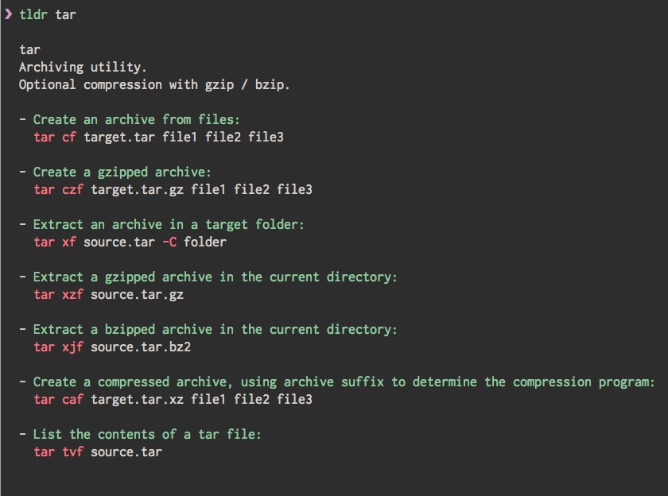

<div align="center">
<h1></h1>

[![Build status][github-actions-image]][github-actions-url]
[![Gitter chat][gitter-image]][gitter-url]
[![Merged PRs][prs-merged-image]][prs-merged-url]
[![GitHub contributors][contributors-image]][contributors-url]
[![license][license-image]][license-url]

[github-actions-url]: https://github.com/tldr-pages/tldr/actions
[github-actions-image]: https://img.shields.io/github/workflow/status/tldr-pages/tldr/CI.svg
[gitter-url]: https://gitter.im/tldr-pages/tldr
[gitter-image]: https://img.shields.io/badge/chat-on_gitter-deeppink
[prs-merged-url]: https://github.com/tldr-pages/tldr/pulls?q=is:pr+is:merged
[prs-merged-image]: https://img.shields.io/github/issues-pr-closed-raw/tldr-pages/tldr.svg?label=merged+PRs&color=green
[contributors-url]: https://github.com/tldr-pages/tldr/graphs/contributors
[contributors-image]: https://img.shields.io/github/contributors/tldr-pages/tldr.svg
[license-url]: https://github.com/tldr-pages/tldr/blob/master/LICENSE.md
[license-image]: https://img.shields.io/badge/license-CC_BY_4.0-blue.svg
</div>

## What is tldr-pages?

The **tldr-pages** project is a collection of community-maintained help pages
for command-line tools, that aims to be a simpler, more approachable complement
to traditional [man pages](https://en.wikipedia.org/wiki/Man_page).

Maybe you are new to the command-line world? Or just a little rusty?
Or perhaps you can't always remember the arguments to `lsof`, or `tar`?

It certainly doesn't help that the first option explained in `man tar` is:

```
-b blocksize
   Specify the block size, in 512-byte records, for tape drive I/O.
   As a rule, this argument is only needed when reading from or writing to tape drives,
   and usually not even then as the default block size of 20 records (10240 bytes) is very common.
```

There seems to be room for simpler help pages, focused on practical examples.
How about:



This repository is just that: an ever-growing collection of examples
for the most common UNIX, Linux, macOS, SunOS and Windows command-line tools.

## How do I use it?

A popular and convenient way to access these pages on your computer
is to install the [Node.js client](https://github.com/tldr-pages/tldr-node-client),
which is supported by the tldr-pages project maintainers:

    npm install -g tldr

That way you can write `tldr tar` in the terminal to show the tldr page for `tar`,
just like you would write `man tar` to show its manpage.

However, if you just want to browse without installing anything, check
out the [PDF version](https://tldr.sh/assets/tldr-book.pdf).

There are also various other clients provided by the community,
both for the command line and for other platforms:

- Alfred Workflow
  - [tldr-alfred](https://github.com/cs1707/tldr-alfred)
  - [alfred-tldr](https://github.com/konoui/alfred-tldr)
- [Albert Plugin](https://github.com/bergercookie/awesome-albert-plugins/tree/master/plugins/tldr_pages)
- Android clients:
  - [tldroid](https://github.com/hidroh/tldroid), available on
    [Google Play](https://play.google.com/store/apps/details?id=io.github.hidroh.tldroid) *(outdated)*
  - [tldr-flutter](https://github.com/Techno-Disaster/tldr-flutter), available on
    [Google Play](https://play.google.com/store/apps/details?id=wtf.technodisaster.tldr)
- Bash clients:
  - [tldr](https://github.com/raylee/tldr)
  - [tldr-bash-client](https://gitlab.com/pepa65/tldr-bash-client)
- [C# client](https://github.com/principis/tldr-sharp)
- [C client](https://github.com/tldr-pages/tldr-c-client):
  `brew install tldr`
- [Chrome Extension](https://github.com/hill/tldr-chrome) available on
  [Chrome Web Store](https://chrome.google.com/webstore/detail/tldr-chrome/nnmlddkpgoecicoallmimonoboialpap)
- [Crystal client](https://github.com/porras/tlcr):
  `brew install porras/tap/tlcr`
- [Dart client](https://github.com/hterkelsen/tldr):
  `pub global activate tldr`
- [Dash docset](https://github.com/Moddus/tldr-python-dash-docset):
  Open `Preferences` > `Downloads` > `User Contributed` and find `tldr pages` in the list
- [Discord Bot](https://github.com/sschr15/tldr-discord):
  [Follow the building instructions](https://github.com/sschr15/tldr-discord#building) or
  [use a privately hosted version](https://discord.com/api/oauth2/authorize?client_id=742800507210301520&permissions=18432&scope=bot)
- Docker images:
    - [tldr-docker](https://github.com/nutellinoit/tldr-docker) - Run the `tldr` command via a docker container: `alias tldr='docker run --rm -it -v ~/.tldr/:/root/.tldr/ nutellinoit/tldr'`
- Elixir clients:
  - [ExTldr](https://github.com/ivanhercaz/extldr).
  - [TLDR Elixir Client](https://github.com/edgurgel/tldr_elixir_client)
  (binaries not yet available)
- [Emacs client](https://github.com/kuanyui/tldr.el), available on
  [MELPA](https://github.com/melpa/melpa)
- Go clients:
  - [github.com/pranavraja/tldr](https://github.com/pranavraja/tldr):
    `go get github.com/pranavraja/tldr`
    (or [platform binaries](https://github.com/pranavraja/tldr/releases))
  - [4d63.com/tldr](https://4d63.com/tldr):
    `go get 4d63.com/tldr` or `brew install 4d63/tldr/tldr`
    (or [platform binaries](https://github.com/leighmcculloch/tldr/releases))
  - [github.com/elecprog/tldr](https://github.com/elecprog/tldr):
    `go get github.com/elecprog/tldr`
    (or [platform binaries](https://github.com/elecprog/tldr/releases))
  - [github.com/isacikgoz/tldr](https://github.com/isacikgoz/tldr):
    `go get github.com/isacikgoz/tldr`
    (or [platform binaries](https://github.com/isacikgoz/tldr/releases))
- iOS clients:
  - [tldr-man-page](https://github.com/freesuraj/TLDR), available on
    [App Store](https://appsto.re/sg/IQ0-_.i)
  - [tldr-pages](https://github.com/mflint/ios-tldr-viewer), available on
    [App Store](https://itunes.apple.com/us/app/tldt-pages/id1071725095?ls=1&mt=8)
- Haskell clients:
  - [tldr-hs](https://github.com/psibi/tldr-hs):
  `stack install tldr`
  or `apt-get install tldr` on Debian-based distributions
  - [fast-tldr](https://github.com/gutjuri/fast-tldr)
- [Java client](https://github.com/seenukarthi/tldr-java-client)
- [Keypirinha Plugin](https://github.com/ronan696/keypirinha-tldr)
- [Node.js client](https://github.com/tldr-pages/tldr-node-client):
  `npm install -g tldr`
- [OCaml client](https://github.com/RosalesJ/tldr-ocaml): `opam install tldr`
- [Perl5 client](https://github.com/shoichikaji/perl-tldr):
  `cpanm App::tldr`
- [PHP client](https://github.com/BrainMaestro/tldr-php):
  `composer global require brainmaestro/tldr`
- Python clients:
  - [tldr-python-client](https://github.com/tldr-pages/tldr-python-client):
    `pip install tldr` or `pacman -S tldr` on Arch Linux
  - [tldr.py](https://github.com/lord63/tldr.py):
    `pip install tldr.py` or `apt-get install tldr-py` on Debian-based distributions
- [R client](https://github.com/kirillseva/tldrrr):
  `devtools::install_github('kirillseva/tldrrr')`
- [Ruby client](https://github.com/YellowApple/tldrb):
  `gem install tldrb`
- [Rust client](https://github.com/dbrgn/tealdeer):
  `cargo install tealdeer` or `brew install tealdeer`
- [Vim Client](https://github.com/wlemuel/vim-tldr)
- [Visual Studio Code extension](https://github.com/bmuskalla/vscode-tldr) available on [Visual Studio Code Marketplace](https://marketplace.visualstudio.com/items?itemName=bmuskalla.vscode-tldr)
- Web clients:
    - [tldr.jsx](https://github.com/ostera/tldr.jsx): http://tldr.ostera.io
    - [tldr.finzzz.net](https://git.finzzz.net/tldr/): https://tldr.finzzz.net
    - [DistroWatch](https://distrowatch.com/dwres.php?resource=man-pages)
    - [tldr.ooops.me](https://tldr.ooops.me): web client with multilingual support
    - [TLDR Persian](https://opoet7.github.io/tldr-persian/): Web Client in Persian

There is also a comprehensive
[list of clients in our Wiki](https://github.com/tldr-pages/tldr/wiki/tldr-pages-clients).

## How do I contribute?

- Your favourite command isn't covered?
- You can think of more examples for an existing command?

All `tldr` pages are kept as Markdown files right here in this repository,
so you can edit them directly and submit your changes as pull requests.

All contributions are welcome!
We strive to maintain a [welcoming and collaborative](GOVERNANCE.md) community.
Have a look at the [contributing guidelines](CONTRIBUTING.md), and go ahead!

If you'd like to contribute to translations, you can visit <https://lukwebsforge.github.io/tldri18n/>
to see the current progress of all translations.

## Similar projects

- [Cheat](https://github.com/cheat/cheat)
  allows you to create and view interactive cheatsheets on the command-line.
  It was designed to help remind *nix system administrators of options
  for commands that they use frequently, but not frequently enough to remember.

- [Bro pages](http://bropages.org/)
  are a highly readable supplement to man pages.
  Bro pages show concise, common-case examples for Unix commands.
  The examples are submitted by the user base, and can be voted up or down;
  the best entries are what people see first when they look up a command.

- [kb](https://github.com/gnebbia/kb)
  is a minimalist command line knowledge base manager.
  kb can be used to organize your notes and cheatsheets in a minimalist
  and clean way. It supports also non-text files.

- [eg](https://github.com/srsudar/eg)
  provides detailed examples with explanations on the command line.
  Examples come from the repository, but `eg` supports displaying
  custom examples and commands alongside the defaults.

- [devhints](https://devhints.io/)
  Rico's cheatsheets are not just focused on the command line and
  include a plethora of other cheatsheets related to programming.

## What does "tldr" mean?

TL;DR stands for "Too Long; Didn't Read".
It originates in Internet slang, where it is used to indicate that a long text
(or parts of it) has been skipped as too lengthy.
Read more in How-To Geek's [article](https://www.howtogeek.com/435266/what-does-tldr-mean-and-how-do-you-use-it/).
