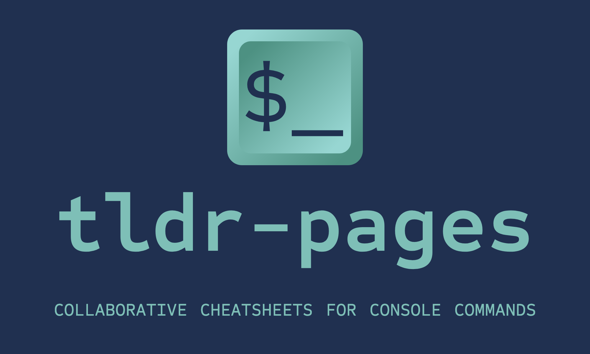

<div align="center">
  <h1><a href="https://tldr.sh/"></a></h1>

[![Build status][github-actions-image]][github-actions-url]
[![Matrix chat][matrix-image]][matrix-url]
[![Merged PRs][prs-merged-image]][prs-merged-url]
[![GitHub contributors][contributors-image]][contributors-url]
[![license][license-image]][license-url]

[github-actions-url]: https://github.com/tldr-pages/tldr/actions
[github-actions-image]: https://img.shields.io/github/actions/workflow/status/tldr-pages/tldr/ci.yml?branch=main&label=Build
[matrix-url]: https://matrix.to/#/#tldr-pages:matrix.org
[matrix-image]: https://img.shields.io/matrix/tldr-pages:matrix.org?label=Chat+on+Matrix
[prs-merged-url]: https://github.com/tldr-pages/tldr/pulls?q=is:pr+is:merged
[prs-merged-image]: https://img.shields.io/github/issues-pr-closed-raw/tldr-pages/tldr.svg?label=Merged+PRs&color=green
[contributors-url]: https://github.com/tldr-pages/tldr/graphs/contributors
[contributors-image]: https://img.shields.io/github/contributors-anon/tldr-pages/tldr.svg?label=Contributors
[license-url]: https://github.com/tldr-pages/tldr/blob/main/LICENSE.md
[license-image]: https://img.shields.io/badge/license-CC_BY_4.0-blue.svg?label=License
</div>

## What is tldr-pages?

The **tldr-pages** project is a collection of community-maintained help pages
for command-line tools, that aims to be a simpler, more approachable complement
to traditional [man pages](https://en.wikipedia.org/wiki/Man_page).

Maybe you're new to the command-line world? Perhaps you're just a little rusty or can't always recall the arguments for commands like `lsof`, or `tar`?

It certainly doesn't help that, in the past, the first option explained in `man tar` was:

```console
$ man tar
...
-b blocksize
   Specify the block size, in 512-byte records, for tape drive I/O.
   As a rule, this argument is only needed when reading from or writing to tape drives,
   and usually not even then as the default block size of 20 records (10240 bytes) is very common.
...
```

There seems to be room for simpler help pages, focused on practical examples.
How about:


This repository is just that: an ever-growing collection of examples
for the most common UNIX, Linux, macOS, SunOS, Android and Windows command-line tools.

## How do I use it?

> [!TIP]
> For browsing without installing a client on your computer,
> see the web client at <https://tldr.inbrowser.app> (with offline support using PWA).

A popular and convenient way to access these pages on your computer
is to install the official [Node.js client](https://github.com/tldr-pages/tldr-node-client):

```shell
npm install -g tldr
```

Alternatively, you can also use the official [Python client](https://github.com/tldr-pages/tldr-python-client), which can be installed via [pip3](https://pypi.org/project/tldr/) (or [other package managers](https://github.com/tldr-pages/tldr-python-client#installation)):

```shell
pip3 install tldr
```

Linux and Mac users can also install the official [Rust Client](https://github.com/tldr-pages/tlrc) using [Homebrew](https://formulae.brew.sh/formula/tlrc) (or [other package managers](https://github.com/tldr-pages/tlrc#installation) on other operating systems):

```shell
brew install tlrc
```

Then you have direct access to simplified, easy-to-read help for commands, such as `tar`,
accessible through typing `tldr tar` instead of the standard `man tar`.

If you don't want to install any software,
check out the [PDF version](https://tldr.sh/assets/tldr-book.pdf).

There are also **various other clients** provided by the community,
both for the command-line and for other platforms.
For a comprehensive list of clients, head over to our [Wiki](https://github.com/tldr-pages/tldr/wiki/tldr-pages-clients).

## How do I contribute to tldr-pages?

All contributions are welcome!

Some ways to contribute include:

- Adding your favorite command which isn't covered.
- Adding examples or improving the content of an existing page.
- Adding requested pages from our issues with the [help wanted](https://github.com/tldr-pages/tldr/issues?q=is%3Aopen+is%3Aissue+label%3A%22help+wanted%22) label.
- Translating pages into different languages.

All `tldr` pages are written in markdown, so they can be edited quite easily and changes can be submitted in
pull requests here using Git on the command-line or
using the GitHub web interface.

We strive to maintain a [welcoming and collaborative](GOVERNANCE.md) community.
If it's your first time contributing, have a look at the [contributing guidelines](CONTRIBUTING.md), and go ahead!

If you'd like to contribute to translations, you can visit <https://lukwebsforge.github.io/tldri18n/>
to see the overall progress of all translations, and which translations are missing or outdated.

You are also welcome to join us on the [matrix chatroom](https://matrix.to/#/#tldr-pages:matrix.org)!

## Similar projects

- [Command Line Interface Pages](https://github.com/command-line-interface-pages)
  allows you to write standardized help pages for CLI, directories and configs.

- [Cheat](https://github.com/cheat/cheat)
  allows you to create and view interactive cheatsheets on the command-line.
  It was designed to help remind *nix system administrators of options
  for commands that they use frequently, but not frequently enough to remember.

- [cheat.sh](https://cheat.sh/)
  Aggregates cheat sheets from multiple sources (including tldr-pages)
  into 1 unified interface.

- [devhints](https://devhints.io/)
  Rico's cheatsheets are not just focused on the command-line and
  include a plethora of other cheatsheets related to programming.

- [eg](https://github.com/srsudar/eg)
  provides detailed examples with explanations on the command-line.
  Examples come from the repository, but `eg` supports displaying
  custom examples and commands alongside the defaults.
  
- [kb](https://github.com/gnebbia/kb)
  is a minimalist command-line knowledge base manager.
  kb can be used to organize your notes and cheatsheets in a minimalist
  and clean way. It also supports non-text files.

- [navi](https://github.com/denisidoro/navi)
  is an interactive cheatsheet tool, which allows you to browse through
  specific examples or complete commands on the fly.

- [bropages (deprecated)](http://bropages.org)
  are a highly readable supplement to man pages.
  It shows concise, common-case examples for Unix commands.
  The examples are submitted by the user base, and can be voted up or down;
  the best entries are what people see first when they look up a command.

## What does "tldr" mean?

TL;DR stands for "Too Long; Didn't Read".
It originated as Internet slang, where it is used to indicate that a long text
(or parts of it) has been skipped as too lengthy.
Read more in How-To Geek's [article](https://www.howtogeek.com/435266/what-does-tldr-mean-and-how-do-you-use-it/).
