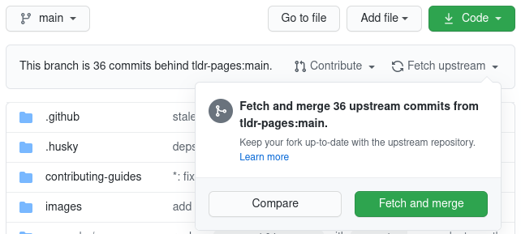

# Opening a Pull Request

Most people submit pull requests to the tldr-pages project
[using GitHub's web interface][pr-howto].

If you prefer, you can do most of the process using the command-line instead.
The overall process should look somewhat like this:

1. Fork the tldr-pages/tldr repository on the GitHub web interface.

2. Clone your fork locally:
  `git clone https://github.com/{{your_username}}/tldr.git && cd tldr`

3. Create a feature branch, e.g. named after the command you plan to edit:
  `git checkout -b {{branch_name}}`

  > :warning: It is bad practice to submit a PR from the `main` branch of your forked repository. Please create pull requests from a well named feature branch.

4. Make your changes (edit existing files or create new ones)

5. Commit the changes (following the [commit message guidelines][commit-msg]):
  `git commit --all -m "{{commit_message}}"`

6. Push the commit(s) to your fork:
  `git push origin {{branch_name}}`

  > :warning: Please avoid force-pushing since it makes the review process harder.

7. Go to the GitHub page for your fork and click the green "Compare & pull request" button.

Please only send related changes in the same pull request.
Typically a pull request will include changes in a single file **unless the pull request is introducing translations**.
(Exceptions are [occasionally acceptable][mass-changes])

[pr-howto]: ../CONTRIBUTING.md#submitting-a-pull-request
[commit-msg]: ../CONTRIBUTING.md#commit-message
[mass-changes]: https://github.com/tldr-pages/tldr/pulls?&q=is:pr+is:merged+label:"mass+changes"

# Updating your fork

Forks of GitHub repositories aren't updated automatically. To keep your fork up-to-date with the latest changes and avoid merge conflicts, you should update it regularly.

There are two ways to update your fork.

1. Via the GitHub web interface. Click `Fetch upstream` and then `Fetch and merge` on the fork as shown below:



2. Using Git in the terminal:

```bash
git checkout main
git remote add upstream https://github.com/tldr-pages/tldr.git  # only run if you don't already have the upstream remote (check with "git remote -v")
git fetch upstream main
git rebase upstream/main     # in case you have any merge conflicts, click the link below to see how to resolve them
git push --force-with-lease  # not needed if you only want to update your local repository
```
[How to resolve merge conflicts](https://docs.github.com/en/github/collaborating-with-pull-requests/addressing-merge-conflicts/resolving-a-merge-conflict-using-the-command-line)

# Changing the email of your last commit

If the email that you used for the last commit isn't associated with your GitHub account, you can either add it [here](https://github.com/settings/emails) or change the email of the commit with the following commands:

```bash
git commit --amend --author="Your Name <new.email@example.com>"
git push --force-with-lease
```

# Changing the email of any commit(s)

1. Perform an [interactive rebase](https://git-scm.com/docs/git-rebase#Documentation/git-rebase.txt--i), specifying the reference of the earliest commit to modify as the argument. For example, if the earliest commit with the wrong email address was 6 commits ago, you can specify the commit hash or just `HEAD~6`.

```bash
git rebase --interactive HEAD~6
```

2. You'll see a list of commits starting from the referenced commit to `HEAD`. All of them will default to the instruction `pick`, this means use the commit as-is when replaying them. For the commits you want to edit, replace the word `pick` for `edit`, then save and exit the editor.

3. The branch will rewind to the referenced commit, then replay them until it reaches a commit with the `edit` instruction. Amend the commit for the correct email address, then continue rebasing. Repeat this step until you've successfully finishing rebasing and replayed all commits.

```bash
git commit --amend --author "Your Name <correct@example.org>"
git rebase --continue
```

4. Finally, because you modified the branch history, you'll need to force push back to your remote repository.

```bash
git push --force-with-lease
```

[](https://asciinema.org/a/fFMZzQOgJyfUf8HTnXyRj0v02)
